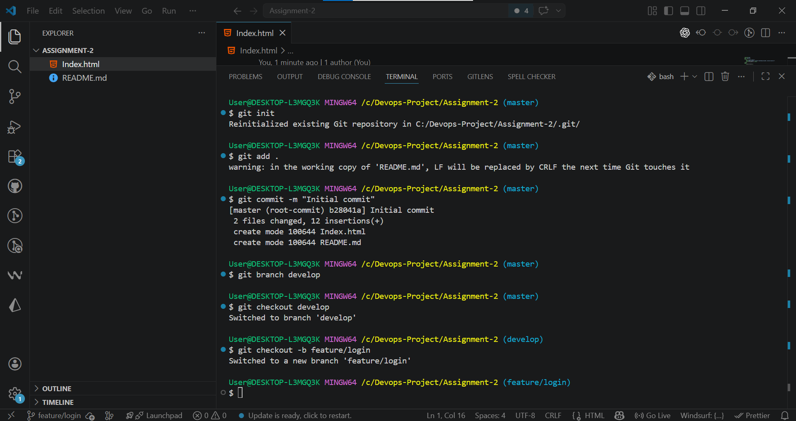

# 🛠️ DevOps Assignment 2 – Git Branching & Workflow

## 📌 Project Overview
This project demonstrates real-world Git workflow practices including branching strategy, merging, rebasing, commit history management, and professional version control techniques. The goal is to simulate a collaborative software development environment using Git.

---

## 📁 Repository Structure

main
├── develop
│ ├── feature/login
│ ├── feature/payment
│ ├── feature/profile
│ └── bugfix/login-error

---

## 🚀 Git Workflow Implementation

### 🔹 1. Repository Initialization
The repository was initialized and configured with remote GitHub origin.

### Commands Used:
```bash
git init
git branch -M main
git remote add origin <repository-url>
git push -u origin main
🔹 2. Branching Strategy

Multiple branches were created following feature-based development:

Feature Branches:
feature/login
feature/payment
feature/profile
Bugfix Branch:
bugfix/login-error
Commands Used:
git checkout -b develop
git checkout -b feature/login
git checkout -b feature/payment
git checkout -b feature/profile
git checkout -b bugfix/login-error
🔹 3. Merge & Rebase Strategy
✔ Merge Strategy

A feature branch was merged into develop using standard merge:

git checkout develop
git merge feature/login
✔ Rebase Strategy

A feature branch was rebased onto develop to maintain linear history:

git checkout feature/payment
git rebase develop
🔹 4. Commit History Management

A feature branch was used to demonstrate advanced commit history manipulation.

Steps Performed:
Created at least 5 commits
Performed interactive rebase
Squashed multiple commits into a single commit
Reworded commit messages for clarity
Commands Used:
git rebase -i HEAD~5

During interactive rebase:

pick → keep commit
squash → combine commits
reword → modify commit message

---

## 📊 Key Git Concepts Used

### 🔀 Merge vs Rebase
- **Merge:** Combines branches and preserves full history
- **Rebase:** Rewrites commit history for a clean linear structure

### 🧹 Squash
Combines multiple commits into a single meaningful commit to keep history clean.

### ✏️ Reword
Allows modification of commit messages during interactive rebase.

---


## 📸 Screenshots



---

## 🧠 Learning Outcomes
- Understanding Git branching workflow
- Practical experience with merge and rebase strategies
- Commit history management using interactive rebase
- Professional repository organization

---

## 📌 Submission Info
- Repository: https://github.com/tawhid3482/DevOps-Assignment-2
- Author: Tawhidul Islam
